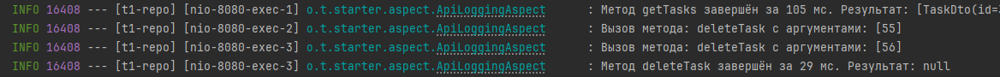

# custom-log-starter
Разработка собственного Spring Boot стартера, который будет добавлять функциональность логирования API-запросов и ответов в приложении

Для того, чтобы пользоваться данным стартером необходимо:
- скачать данный репозиторий
- перейти при помощи команды cd в директорию, куда скачался данный репозиторий
- в командной строке выполнить команду: mvn clean install 
(после этой команды, jar-файл установится в папку .m2, эта папка вашего локального репозитория maven)
- открыть pom.xml нужного проекта и добавить зависимость
```angular2html
<dependency>
    <groupId>org.tolstikov.starter</groupId>
    <artifactId>starter</artifactId>
    <version>1.0-SNAPSHOT</version>
</dependency>
```
- не забыть нажать кнопку обновления после внесения изменений в pom-файл
- Profit! теперь вы можете использовать в любом методе аннтотацию @LogApi
- для управления стартером, добавьте настройки в application.yml
```angular2html
custom:
  logging:
    enabled: true
    level: debug
```
или в application.properties:
```angular2html
custom.logging.enabled=true
custom.logging.level=debug
```
Теперь можно запускать ваш проект, и при вызове методов, вы будете видеть нечто вроде:




Вы великолепны!
